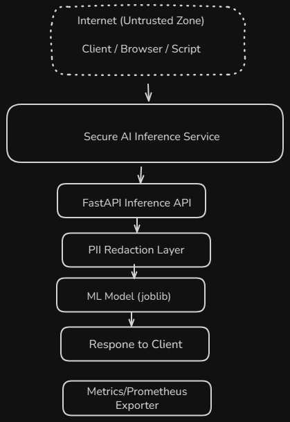

Ctrl + Y
# Threat Model – Secure AI Inference Pipeline

*Data from the untrusted Internet enters the Secure AI Inference Service through a FastAPI endpoint, where authentication, PII redaction, and model inference are performed before generating responses and exporting metrics.*

## System Overview
Client → FastAPI → PII redaction → Model → Response; metrics at /metrics; health at /healthz.

## Assets
| Asset | Description | Importance |
|------|-------------|------------|
| API endpoint | Public interface to model | High |
| API key | Auth credential | High |
| Model weights | IP & integrity critical | High |
| Request bodies | May include PII | High |
| Logs/metrics | Ops data; avoid PII | Medium |

## Trust Boundaries
Internet ↔ API; API process ↔ model artifact; container ↔ host.

## STRIDE Highlights
- **Spoofing:** Unauth clients → API key + rate limit
- **Tampering:** Model or request manipulation → signed artifacts, validation
- **Repudiation:** Lack of audit → structured logs + request IDs
- **Info Disclosure:** PII leak → redaction + headers
- **DoS:** Flooding `/predict` → rate limiting
- **EoP:** Devs accessing secrets → least-priv, no secrets in code

## Top Risks & Mitigations
1. Unauth access → API key required; 401 by default  
2. PII exposure in logs/output → redaction; no PII logging  
3. Model tampering → immutable image; future: hash/sign model  
4. DoS → rate limiter; future: Redis-backed  
5. Secrets in repo → detect-secrets baseline; .env only

## Monitoring & Response
- `/metrics` (Prometheus format), `/healthz` liveness.
- Bandit + detect-secrets in local checks.

*Author:* Jason • *Date:* (fill in)
